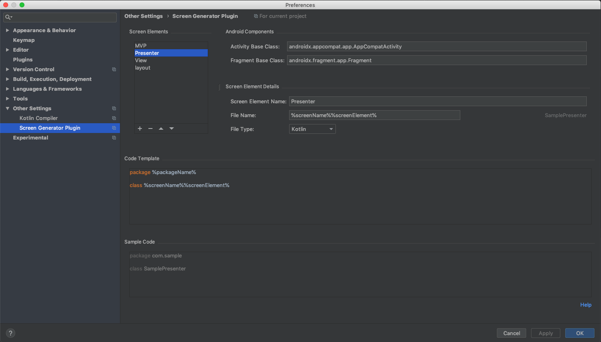
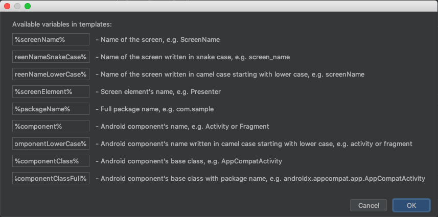
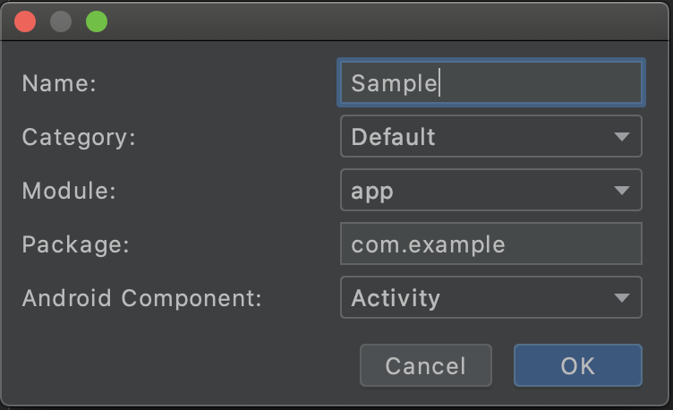

# Screen Generator Plugin

This is an Android Studio plugin, which helps you automate your everyday development by generating all necessary files for your project's architecture when you are creating a new screen.

For example, you are using MVP architecture and you are creating a Main screen. You can set up the plugin to generate for you:
<ul>
<li>MainActivity.kt</li>
<li>MainView.kt</li>
<li>MainPresenter.kt</li>
<li>activity_main.xml</li>
</ul>

And also you can set dynamically changing content of all files depending on screen's name, base Android component and other variables.

## How to install?

## How to use it?

Set up all files that your architecture requires to create a new screen in Preferences -> Other Settings ->  Screen Generator Plugin

To find out what are available variables to put in your templates, simply click Help link in Settings.

Once you are done, you can create now a new screen by clicking File -> New -> Screen from the top menu or simply by right-clicking on any package in your project structure and choosing New -> Screen. 

Feel free to open an issue if you notice any bug or have any feature request!
